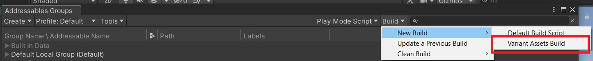
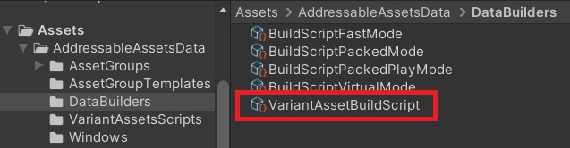
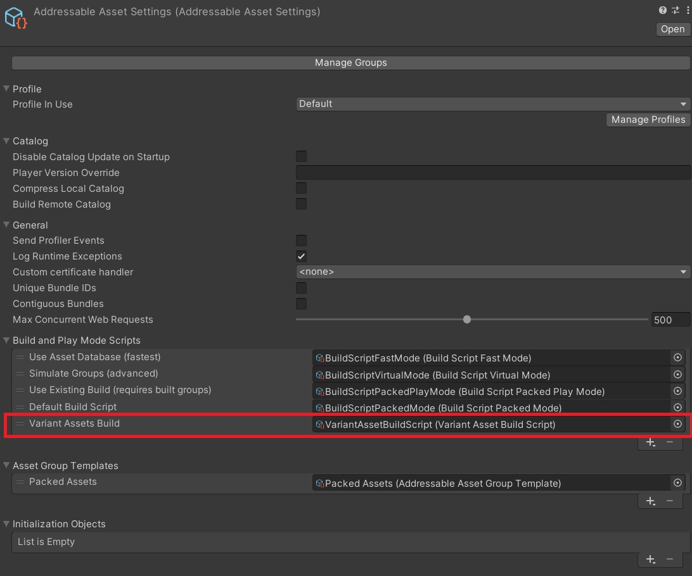
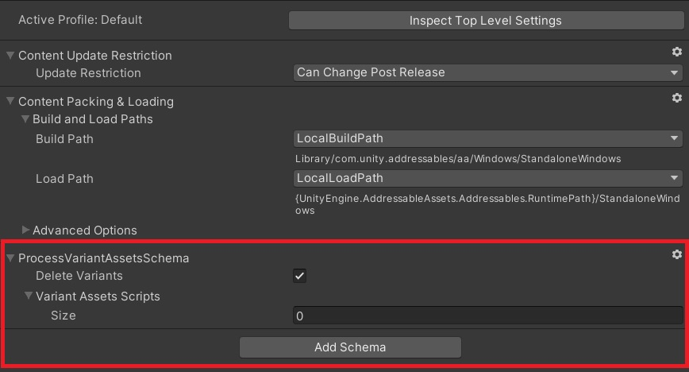
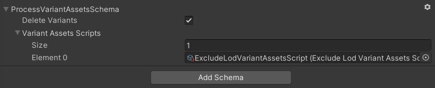

# ScriptableVariantAssetBuild

This creates a new build script that enables creating variants assets for a build.

## Set up the VariantAssetBuild Script

In the "AddressableAssetsData/DataBuilders" folder, right mouse click in the folder, "Create->Addressables->Custom Build->Variant Assets", to create a new VariantAssets scriptable object.

Then, in your Addressable Settings, add the new Variant Assets Build script to your list of "Build and Play Mode Scripts"

## Schema and Groups

The build script will only run on Addressable Groups with the ProcessVariantAssetsSchema.

With that schema added, then any number of VariantAssetsScript assets can be added.  Example, create the instances in a folder in "AddressableAssetsData/VariantAssetScripts".

